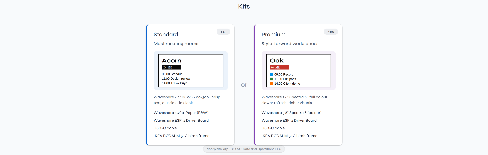
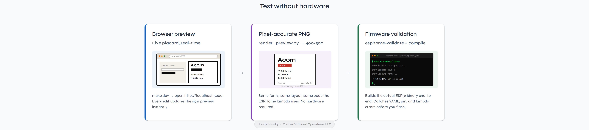
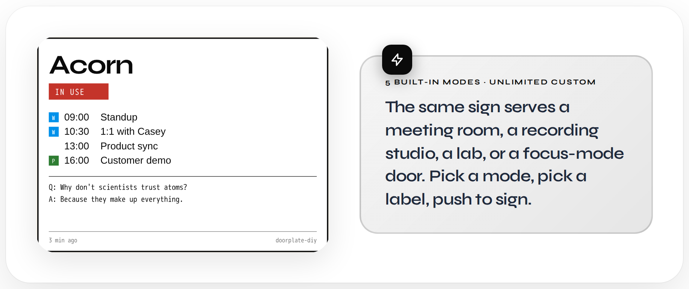
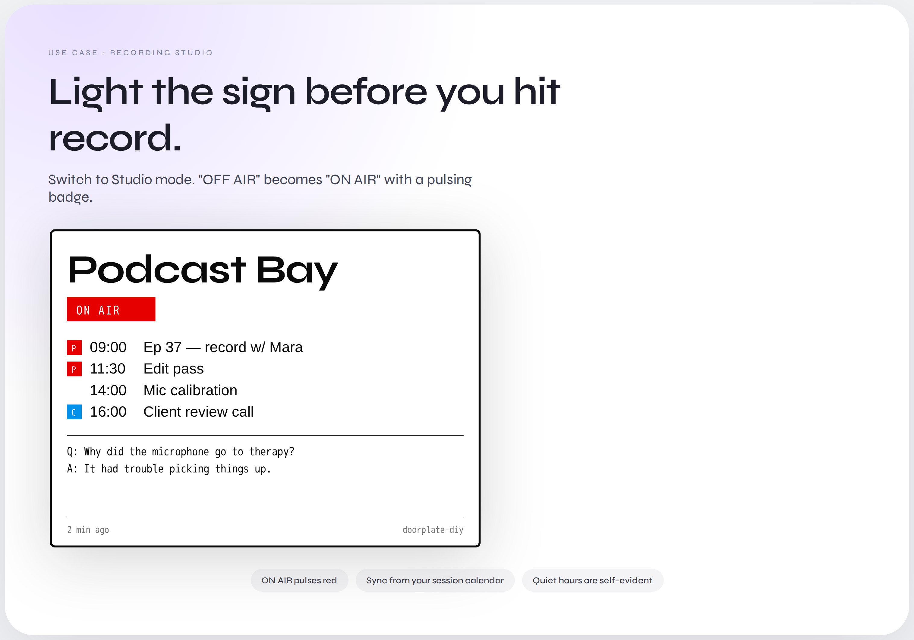
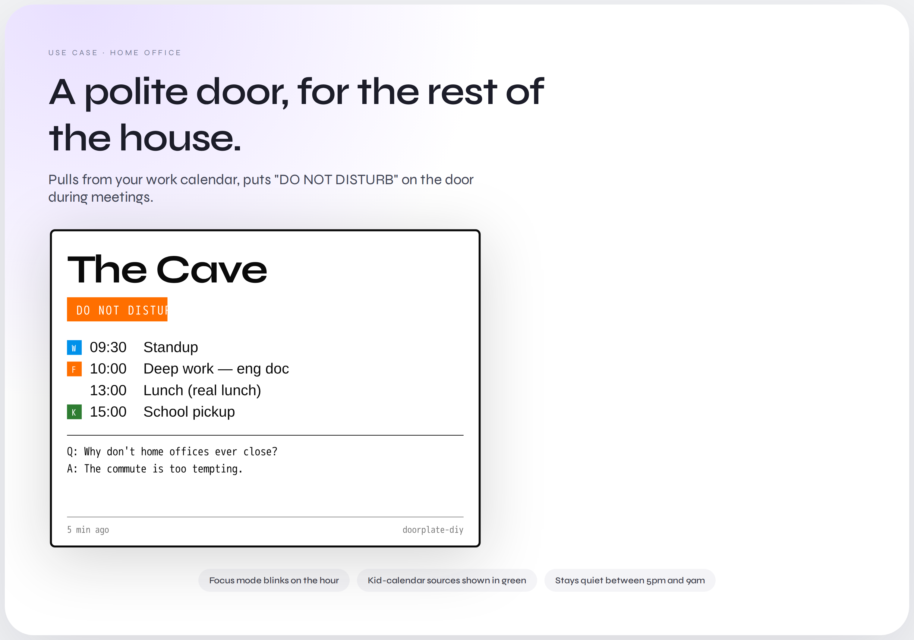
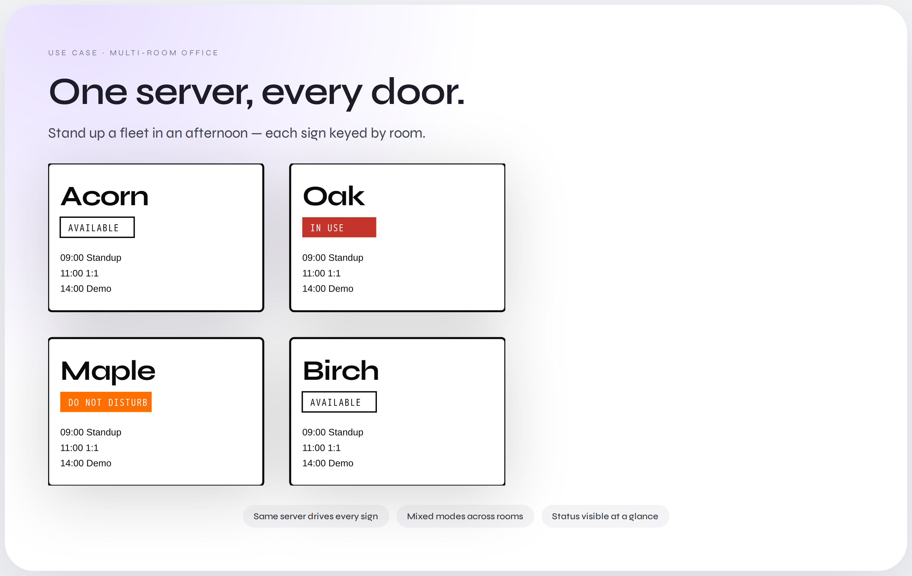
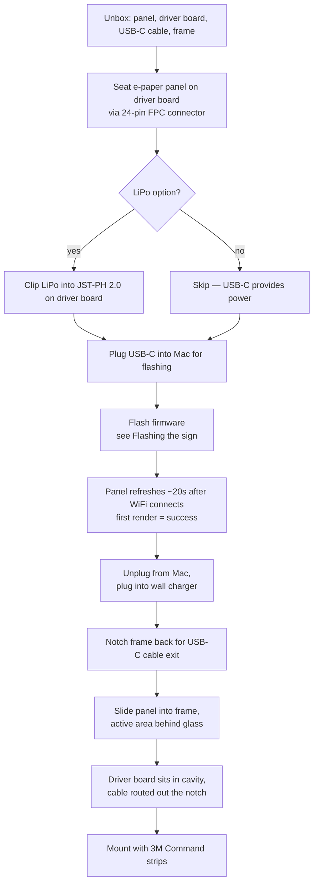
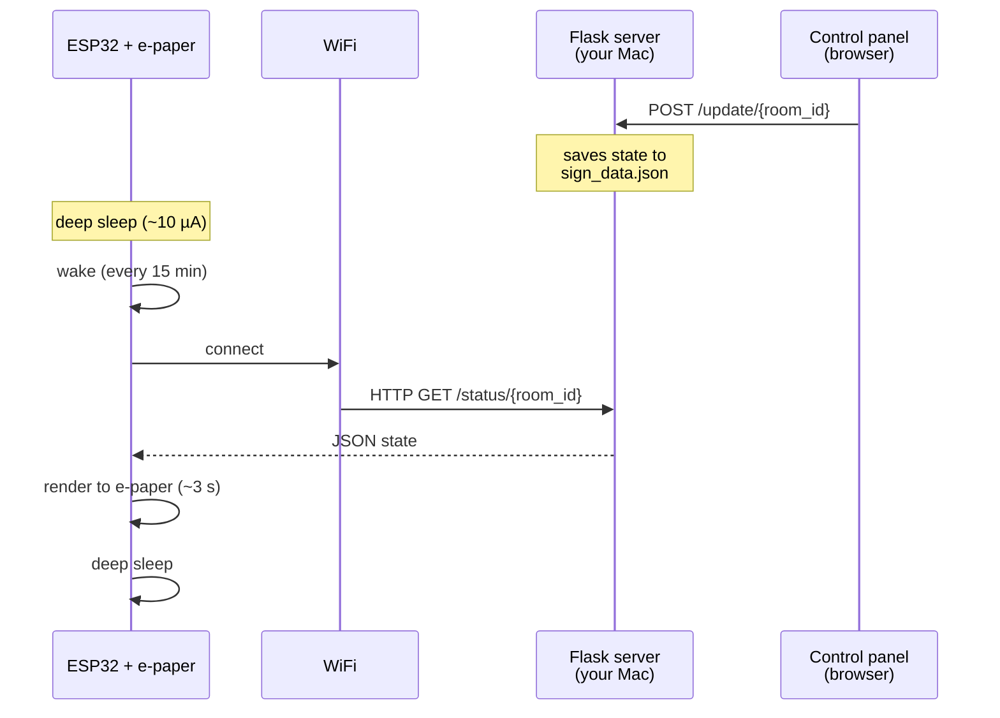

# doorplate-diy

**A WiFi-connected e-ink meeting room sign you build in an afternoon.**

From [Data and Operations LLC](https://dataandoperations.com).


---

## How it works

```
  ┌─────────────────┐        ┌──────────┐        ┌──────────────┐
  │  Mac (Flask)    │        │   WiFi   │        │  ESP32 + e-  │
  │  control panel  │──/ /──▶│  router  │──/ /──▶│  ink display │
  │  /status /update│        │          │        │              │
  └─────────────────┘        └──────────┘        └──────────────┘
        ▲                                                │
        │             every 15 min: GET /status          │
        └────────────────────────────────────────────────┘
```

The Mac runs a tiny Flask server with a control-panel UI. The ESP32 wakes
from deep sleep every 15 minutes, pulls the current room state over HTTP,
redraws the e-ink panel, and sleeps again.

## Kits



Pre-assembled kits will be available from Data and Operations LLC soon. In
the meantime, the BOMs below tell you how to self-source.

> **Coming soon** — pre-assembled kits from Data and Operations LLC. For now,
> build your own with the BOMs below.

## Quick start

**1. Clone the repo on the Mac that will control the sign.**

```bash
git clone https://github.com/dataandoperations/doorplate-diy.git
cd doorplate-diy
```

**2. Run the server — pick whichever install path you prefer.**

Both paths expose the same control panel at `http://<your-mac>.local:5000`.

<details open>
<summary><strong>Option A — Python + pip</strong></summary>

```bash
make install-dev
make dev
```
</details>

<details>
<summary><strong>Option B — Docker</strong></summary>

Requires Docker Desktop (or any Docker runtime). The `unless-stopped`
restart policy keeps the sign alive across Mac restarts once Docker is
running at login.

```bash
make docker-up     # or: docker compose up -d
make docker-logs   # tail logs
make docker-down   # stop
```

Pass an auth token via env var: `DOORPLATE_TOKEN=your-secret make docker-up`.
Persistent state (`sign_data.json`) lands in `./data/`, which is gitignored.
</details>

**3. Open the control panel** at `http://<your-mac>.local:5000`, edit the
   room name + schedule, and hit **Push to Sign**.

**4. Assemble and flash the sign** — see the [**Assembly**](#assembly)
and [**Flashing the sign**](#flashing-the-sign) sections below. Rough flow:
seat the e-paper panel on the driver board, plug in USB-C, run
`esphome run esphome/meeting-sign.yaml`.

**5. Slot the panel into a picture frame** (see [**Case**](#case--picture-frame-hack)).

## Test without hardware



You don't need an ESP32 or e-ink panel to try this end-to-end:

1. **Browser preview** — `make dev`, open the control panel, and the
   right-side placard preview mirrors what the e-ink will render as you
   type.
2. **Pixel-accurate PNG** — `make preview` (or
   `python server/render_preview.py`) produces `preview.png` at 400×300,
   using the same fonts and layout as the ESPHome lambda.
3. **Firmware validation** — `make esphome-validate` checks the YAML and
   `esphome compile esphome/meeting-sign.yaml` builds the firmware binary.
   No hardware required.

## Fonts

No manual download step. The font files (Roboto Condensed + Roboto Mono,
Apache-2.0) are fetched on first use:

- **ESPHome builds** pull them via `gfonts://` at compile time and cache
  them under `.esphome/`.
- **`render_preview.py`** auto-downloads them into `esphome/fonts/`
  (gitignored) on first run.

If you want to override with a different font, drop your own TTFs into
`esphome/fonts/` and edit the `font:` block in
`esphome/meeting-sign.yaml`.

## Finding your Mac from the sign

The ESPHome config points at `your-mac.local`. macOS advertises that
hostname automatically via Bonjour. To find yours:

```bash
scutil --get LocalHostName
```

Set that value in `esphome/meeting-sign.yaml` under `substitutions.server_host`.
If DHCP is flaky on your network, reserve a static lease on your router and
put the IP address there instead.

## Keeping the server running

Closing the terminal kills the Flask server. Two ways to keep it alive:

- **Docker** — `docker compose up -d` already uses `restart: unless-stopped`.
  Enable "Start Docker Desktop when you log in" in Docker Desktop settings
  and you're done.
- **pip + launchd** — install the launchd agent:
  ```bash
  # Edit the absolute paths inside the plist first, then:
  cp ops/com.dataandoperations.doorplate.plist ~/Library/LaunchAgents/
  launchctl load ~/Library/LaunchAgents/com.dataandoperations.doorplate.plist
  tail -f ~/Library/Logs/doorplate.log
  ```

For casual use, `tmux new -s doorplate 'make dev'` or `caffeinate -i make dev`
works fine too.

## Modes



The sign ships with five presets, picked from the control panel **Mode**
dropdown:

| Mode         | Free label | Busy label             | Animation (busy only) | Accent     |
| ------------ | ---------- | ---------------------- | --------------------- | ---------- |
| Meeting Room | AVAILABLE  | IN USE                 | none                  | red        |
| Studio       | OFF AIR    | ON AIR                 | pulse                 | bright red |
| Lab          | IDLE       | EXPERIMENT RUNNING     | scanline              | blue       |
| Focus        | OPEN       | DO NOT DISTURB         | blink                 | orange     |
| Custom       | *(your text)* | *(your text)*       | none                  | red        |

Animations play on the control-panel placard preview in real time. On the
e-ink panel, an animated busy mode triggers a 2-frame flash on every wake
(~1.5 s extra refresh, ~every 15 min by default). The e-ink is B&W, so
animation is a visual blink, not color.

## Use cases

Same sign, different room. Three configurations we built for inspiration:

### Podcast studio — ON AIR



Mode: **Studio**. Event titles pull from your recording calendar. The red
badge pulses in the browser preview and gives a visible flash on every
e-ink refresh when the session is live.

### Home office — DO NOT DISTURB



Mode: **Focus**. Work calendar drives the top rows; a separate "kid
calendar" source (green chip) adds the important interruptions. Keep
the door polite without Slack statuses.

### Multi-room office



One server drives every sign. Each room picks its own mode and
schedule. This is on the roadmap as a first-class feature; today you
can run one server per sign as a workaround.

## Time display

Footer format configurable via the control panel **Time format** dropdown:

| Format   | Example          | Notes |
| -------- | ---------------- | ----- |
| Relative | `3 min ago`      | Default. Updates each refresh. |
| 24-hour  | `17:08`          | Local time of the Mac running the server. |
| 12-hour  | `5:08 PM`        | Local time. |
| ISO      | `2026-04-17T17:08:00+00:00` | Raw UTC timestamp. |
| Off      | *(blank)*        | Hides the footer timestamp. |

Formatted server-side, so the e-ink and browser always agree.

## Calendar sources

Attach a **source** to each schedule row to colour-code where it came from.
Useful when you pull from multiple calendars (Work, Personal, Client, Oncall).

In the control panel, expand **Calendar sources**, add a source with:
- **Short** (1–2 chars) — shown as a prefix on the e-ink (`W· 09:00 Standup`)
- **Label** — human-readable name
- **Accent** — colour chip shown in the placard preview
- **ICS URL** *(optional)* — any iCal feed URL to auto-populate today's events

Then pick a source from each schedule row's dropdown. Unsourced rows
render as plain text. When a source has an ICS URL, the server polls it
every 10 minutes (default) and merges today's events into the schedule.
Synced rows show a "synced" badge in the editor and can't be edited
directly — remove the ICS URL to take manual ownership.

### Where to get an ICS URL

- **Google Calendar** → Settings → *Integrate calendar* → *Secret address in iCal format*
- **Apple Calendar** → right-click the calendar → *Share Calendar* → *Public Calendar* → copy URL
- **Outlook.com** → Settings → *Shared calendars* → *Publish a calendar* → ICS link
- **Calendly / Notion / Linear** → search their settings for "ICS" or "iCal feed"

### Enable sync

Set `DOORPLATE_ICS_SYNC=1` so the background worker runs. Default `make dev`
already sets this. Override the polling interval with `DOORPLATE_ICS_POLL_INTERVAL`
(seconds, default 600). Hit the **Refresh now** button in the control panel
to trigger an immediate poll.

### Testing locally without a real calendar

The doorplate server can also **serve its own ICS feeds** for dev/demo.
Point a source at your own server and you never touch Google / Apple /
Outlook:

```bash
echo '{"name":"work","events":[
  {"time":"09:00","title":"Standup"},
  {"time":"14:00","title":"Design review"}
]}' | python3 scripts/make_ics.py --publish
# → http://localhost:5000/ics/work.ics
```

Copy that URL into the control panel's **ICS URL** field, hit **Test**,
and you have an end-to-end sync loop. Rerun the command anytime to update
the feed; hit **↻ Refresh now** in the UI to pick up changes.

Other endpoints the server exposes for feed management:

| Method / Path          | What it does                                      |
| ---------------------- | ------------------------------------------------- |
| `POST /ics/<name>`     | Publish events: `{events: [...], cal_name: "..."}`|
| `GET  /ics/<name>.ics` | Serve the feed back as `text/calendar`            |
| `GET  /ics`            | List published feed names                         |
| `DELETE /ics/<name>`   | Remove a feed                                     |

All mutating endpoints are auth-gated (same `DOORPLATE_TOKEN` as `/update`).
Feeds live in `DOORPLATE_DATA_DIR/ics/` — gitignored, volume-mounted in
Docker, safe to delete.

**Fallback mode**: if you'd rather publish via a static file + `http.server`,
drop `--publish` and the script writes `/tmp/<name>.ics` instead. Useful if
you want to point multiple environments at the same feed, or serve from a
different machine.

Event fields: `time` (`HH:MM`), `title`, optional `duration_min` (default 30),
optional `date` (ISO, default today).

### Troubleshooting

**Before saving a source**, hit **Test** next to the ICS URL field. The
server probes the URL synchronously and shows either the first few events
today or a specific error. Common errors:

- `Server returned 404 — URL is wrong or the calendar's secret token was rotated` — go back to the calendar's settings and copy a fresh URL (for Google: *Settings → Integrate calendar → Secret address in iCal format*). Don't use the "Public address" unless your calendar is genuinely public.
- `Server returned 403` — you grabbed an auth-required URL. Same fix as 404.
- `Server returned an HTML page, not an ICS file` — the URL redirected to a login or consent page. You're using the wrong URL.
- `Network error: ...` — DNS, firewall, or upstream is down.

`webcal://` URLs are automatically converted to `https://` before fetching, so you can paste whichever format your calendar app gives you.

### Limits

- All-day events are skipped (no `HH:MM` to display)
- Events without `SUMMARY` are skipped
- Recurring events are expanded via `recurring-ical-events` (RRULE / EXDATE supported)
- One poll pass is sequential over all sources; a slow/dead URL delays the whole pass

## Multiple rooms

One server instance can drive any number of signs. State is keyed by
`room_id`, with a `default` room created on first run.

**Dashboard**: visit `/` to see all your rooms at a glance — name,
current status badge, and a per-room theme picker. Each card renders
in its own theme so the dashboard doubles as a live theme preview.
Hit `+ New room` to create one (modal form), `Open →` to drop into
that room's control panel, or `Archive` to soft-delete (data preserved,
can be restored later from the archived section).

**Control panel**: lives at `/room/<room_id>`. Edits the room's name,
mode, schedule, calendar sources, time format, and theme. The theme
picker writes to the room on the server so two browsers see the same
theme for a given room.

**API**:

```bash
# list rooms (active only by default; pass include_archived=1 to see all)
curl http://localhost:5000/rooms
curl 'http://localhost:5000/rooms?include_archived=1'

# create a new room (auth-gated if DOORPLATE_TOKEN is set)
curl -X POST http://localhost:5000/rooms \
  -H 'Content-Type: application/json' \
  -d '{"room_id": "acorn", "room_name": "Acorn"}'

# per-room status + update (theme is just another field)
curl http://localhost:5000/status/acorn
curl -X POST http://localhost:5000/update/acorn -d '{"theme": "terminal"}'

# soft delete (archive) and restore — auth-gated
curl -X POST http://localhost:5000/rooms/acorn/archive
curl -X POST http://localhost:5000/rooms/acorn/unarchive

# hard delete — auth-gated, irreversible
curl -X DELETE http://localhost:5000/rooms/acorn
```

Legacy `/status` and `/update` still work — they're aliases for the
`default` room, so existing single-room deploys keep working unchanged.
The default room can't be archived or deleted.

**ESPHome**: flash each physical sign with its own `room_id` substitution.
In `esphome/meeting-sign.yaml`:

```yaml
substitutions:
  room_id: "acorn"   # unique per sign; must match [a-z0-9_-]{1,32}
```

Archived rooms keep their state and `/status/<id>` still responds, so a
sign briefly out of service won't 500 — it just won't get fresh ICS sync
until you restore it.

A file written by an older single-room build is auto-migrated into
`rooms["default"]` on first load — no manual steps.

## Auth

By default, `POST /update` accepts anything on the LAN — fine for a trusted
home or office network.

To require a shared secret:

```bash
export DOORPLATE_TOKEN="pick-something-random"
make dev
```

Then match it on the sign side (`esphome/meeting-sign.yaml`, substitution
`doorplate_token`) and in the control panel
(`localStorage.setItem('doorplateToken', '...')` from the browser console).

## Assembly

End-to-end flow from box-open to hung-on-wall. Budget ~20 minutes for a
first build; second one goes in 10.



### Step-by-step

1. **Seat the panel.** The Waveshare ESP32 Driver Board has a 24-pin FPC
   connector labeled on the silkscreen. Flip the black latch up, slide
   the panel's flat flex cable in (contacts facing **down** toward the
   board), and press the latch back down. No loose wires — one connector
   carries all six signals from the [Wiring](#wiring) table.
2. **Optional LiPo.** If you're going battery-powered, plug a
   2000 mAh LiPo with a JST-PH 2.0 pigtail into the driver board's battery
   header. The onboard charging IC handles top-up whenever USB-C is
   connected. See [Power](#power) for battery life estimates.
3. **First boot over USB-C.** Plug the driver board into the Mac that
   will run the server. This is both your flashing cable and first-boot
   power. The panel will stay blank until firmware is loaded.
4. **Flash** — see [Flashing the sign](#flashing-the-sign). Successful
   first boot looks like: ~20 seconds of silence while the ESP32 connects
   to WiFi, then the panel draws the default "Meeting Room / AVAILABLE"
   placard. If it stays blank for >60 s, check your `secrets.yaml`.
5. **Move to the frame.** Once you see a successful render, unplug from
   the Mac and plug into a 5 V phone charger. Notch the frame's back
   (utility knife or small file — 3 mm × 8 mm slot is plenty) to let the
   USB-C cable exit. Slide the panel into the frame with the active area
   centered behind the glass; the driver board sits in the shadow-box
   cavity behind.
6. **Mount.** 3M Command strips on the frame back. Or use the frame's
   built-in hanger and run the cable through its existing slot.

## Flashing the sign

[ESPHome](https://esphome.io) is the only build tool you need. Install
it once, then `esphome run` handles compile + flash + monitor in one
command.

### Runtime picture

Once flashed, the sign runs on this loop forever:



Everything happens on your LAN — no cloud, no account, no outbound
dependency beyond NTP for the clock.

### One-time setup

1. **Install ESPHome** (pick one):
   ```bash
   pip install esphome          # Python path
   brew install esphome         # Homebrew
   # or: docker run --rm -v "${PWD}":/config -it esphome/esphome
   ```
2. **Add your WiFi creds.** Copy the template and fill it in:
   ```bash
   cp esphome/secrets.example.yaml esphome/secrets.yaml
   $EDITOR esphome/secrets.yaml     # wifi_ssid, wifi_password, ota_password
   ```
   `secrets.yaml` is gitignored.

### Flash it — easy path

If your dashboard server is running on the same machine you flash from,
the per-room settings page walks you through it:

1. Open the dashboard at `http://localhost:5000/`. Create the room if
   needed, then click the **⚙** icon on its card.
2. The settings page shows a **Download doorplate-&lt;id&gt;.yaml**
   button with `server_host` and `room_id` already filled in, plus
   step-by-step flashing instructions.
3. One command pulls the config and flashes in one step:
   ```bash
   make flash ROOM=<room_id>
   ```
   (Or manually: move the downloaded file next to `esphome/secrets.yaml`
   and run `esphome run esphome/doorplate-<room_id>.yaml`.)

Optional: set `ESPHOME_DASHBOARD_URL=http://localhost:6052` in the
server's environment and the settings page surfaces a deep-link into
your local ESPHome dashboard for browser-based OTA updates.

### Flash it — manual path

If you're flashing from a different machine than the server, or want
to customize the YAML:

<details>
<summary>Manual edit + flash</summary>

1. Edit `esphome/meeting-sign.yaml` and set the `server_host`
   substitution to the server's mDNS hostname
   (`scutil --get LocalHostName | sed 's/$/.local/'`). If driving
   multiple signs from one server, also set each sign's `room_id`
   substitution — see [Multiple rooms](#multiple-rooms).
2. Plug the driver board into USB-C, then:
   ```bash
   esphome run esphome/meeting-sign.yaml
   ```

</details>

ESPHome auto-detects the serial port on macOS. First build downloads
the ESP32 toolchain (~2 min, cached after that). After flashing it
drops you into a serial monitor — `Ctrl+C` exits.

### Subsequent updates

After the first USB flash, the ESP32 accepts **OTA updates** over WiFi
— you don't need to physically reach it again:

```bash
esphome run esphome/meeting-sign.yaml   # auto-picks OTA if it can see the sign
```

### Troubleshooting first boot

| Symptom | Likely cause |
| --- | --- |
| Panel stays blank >60 s | Bad `secrets.yaml` or WiFi out of range — check serial monitor |
| "HTTP 404" in serial | `server_host` points at the wrong machine, or server isn't running |
| Garbled / partial render | Font fetch blocked — check build-machine internet |
| Refreshes but shows "not pushed yet" | Server is up but you haven't clicked **Push to Sign** yet |

## Case — picture-frame hack

No custom enclosure required. Both panels drop cleanly into a 5×7"
shadow-box picture frame.

- **Recommended**: [IKEA RÖDALM 5×7" birch effect](https://www.ikea.com/us/en/p/roedalm-frame-birch-effect-30548866/)
  — ~32 mm cavity depth with adjustable-position backing, so the driver
  board and USB-C cable fit cleanly. Warm birch face looks at home in
  most rooms.
- Replace the paper insert with the e-ink panel, facing outward.
- The driver board + USB-C cable live in the shadow-box cavity behind.
- Trim the mat to expose the active display area (~91×77 mm for 4.2",
  ~75×55 mm for 3.6").
- Mount with 3M Command strips or the frame's built-in hanger.
- Notch the frame back (file, utility knife, or Dremel) to route the USB-C
  cable out, or run it through the existing hanger slot.

**Alternates**: IKEA FISKBO (~$3, thinner depth — cable routing is tighter),
or any 5×7" frame with ≥25 mm cavity depth behind the glass.

## Bill of materials

### Standard Kit — Waveshare 4.2" B&W (~$51)

| Part                              | Est. cost | Link                                                                                      |
| --------------------------------- | --------: | ----------------------------------------------------------------------------------------- |
| Waveshare 4.2" e-Paper Module     |    $25    | https://www.waveshare.com/4.2inch-e-paper-module.htm                                      |
| Waveshare ESP32 Driver Board      |    $10    | https://www.waveshare.com/product/e-paper-esp32-driver-board.htm                          |
| USB-C cable + 5 V / 1 A adapter   |     $8    | Any phone charger works (you probably have one)                                           |
| IKEA RÖDALM 5×7" birch frame      |     $5    | https://www.ikea.com/us/en/p/roedalm-frame-birch-effect-30548866/                         |
| *Optional: 2000 mAh LiPo battery* |    *$12*  | *JST-PH 2.0 connector — plugs straight into the driver board*                             |

### Premium Kit — Waveshare 3.6" Spectra 6 color (~$68)

| Part                                       | Est. cost | Link                                                                                      |
| ------------------------------------------ | --------: | ----------------------------------------------------------------------------------------- |
| Waveshare 3.6" e-Paper HAT+ (E, Spectra 6) |    $42    | https://www.waveshare.com/3.6inch-e-paper-hat-plus-e.htm                                  |
| Waveshare ESP32 Driver Board               |    $10    | https://www.waveshare.com/product/e-paper-esp32-driver-board.htm                          |
| USB-C cable + 5 V / 1 A adapter            |     $8    | Any phone charger works (you probably have one)                                           |
| IKEA RÖDALM 5×7" birch frame               |     $5    | https://www.ikea.com/us/en/p/roedalm-frame-birch-effect-30548866/                         |
| *Optional: 2000 mAh LiPo battery*          |    *$12*  | *JST-PH 2.0 connector — plugs straight into the driver board*                             |

> **Driver board note:** the 3.6" Spectra 6 ships as a HAT+ form-factor
> panel. It can be driven from our standard ESP32 Driver Board over raw
> SPI, but the pin mapping differs from the Standard kit. Full wiring
> for this combo is on the roadmap alongside ESPHome's `epaper_spi`
> support for Spectra 6.

## Power

Two ways to run the sign:

**USB-C wall power (default)** — plug any 5 V / 1 A USB-C phone charger
into the driver board's USB-C port. Always-on, never thinks about
batteries. Ideal next to an outlet.

**LiPo battery (stick-anywhere)** — the Waveshare ESP32 Driver Board
has a JST-PH 2.0 connector and an onboard charging IC. Plug in a
2000 mAh LiPo, connect USB-C once to charge, then you're free to mount
the sign anywhere.

Expected battery life with the default 15-minute refresh cadence:

| Battery        | Expected life    |
| -------------- | ---------------- |
| 1000 mAh LiPo  | ~2 weeks         |
| 2000 mAh LiPo  | ~1 month         |
| 3000 mAh LiPo  | ~6 weeks         |

The math: ESP32 wakes ~30 s to fetch + render + sleep, drawing ~70 mA.
Deep sleep is ~10 µA. Average current is ~2.5 mA, which dominates the
battery life calculation. Longer `sleep_duration` in
`esphome/meeting-sign.yaml` → longer battery life.

**Safety:** LiPo cells need care. Don't puncture, don't leave in a hot
car, use cells with a built-in protection circuit (most do).

## Wiring

Both kits use Waveshare's ESP32 Driver Board, which is a drop-in HAT for
their e-paper panels. The driver board has a 24-pin FPC connector that
accepts Waveshare e-paper panels directly — no loose wires required. The
GPIO → panel mapping is fixed:

| Panel signal | ESP32 GPIO |
| ------------ | ---------: |
| BUSY         | GPIO25     |
| RESET        | GPIO26     |
| DC           | GPIO27     |
| CS           | GPIO15     |
| CLK (SCLK)   | GPIO13     |
| MOSI         | GPIO14     |

If you're using a bare ESP32 + loose panel instead of the driver board,
wire per the table above and verify `esphome/meeting-sign.yaml` matches.

## File structure

```
doorplate-diy/
├── .github/workflows/ci.yml       # status checks (ruff, pytest, html, esphome)
├── Makefile                       # make install-dev / dev / test / ci / preview
├── LICENSE                        # MIT
├── README.md
├── pyproject.toml                 # ruff + black config
├── .pre-commit-config.yaml
├── Dockerfile                     # optional container path
├── docker-compose.yml             # optional container path
├── .dockerignore
├── docs/
│   ├── roadmap-current.md         # living Now/Next/Later
│   └── *.png                      # README graphics (hero, kits, modes, use cases)
├── ops/
│   └── com.dataandoperations.doorplate.plist
├── scripts/
│   └── make_ics.py                # dev helper for generating test ICS feeds
├── graphics/
│   └── generate_doorplate_graphics.py  # regenerates docs/*.png (Docker-based)
├── server/
│   ├── server.py                  # Flask app: /, /status, /update, /themes, /sources/*, /ics/*
│   ├── ics_sync.py                # ICS subscription worker
│   ├── render_preview.py          # PIL-based hardware-free simulator
│   ├── requirements.txt
│   ├── requirements-dev.txt
│   ├── tests/
│   │   ├── test_server.py
│   │   ├── test_ics_sync.py
│   │   └── test_render_preview.py
│   └── static/
│       ├── index.html             # control panel (vanilla JS)
│       └── themes/                # ink.css / terminal.css / newsprint.css
└── esphome/
    ├── meeting-sign.yaml
    ├── secrets.yaml               # gitignored template
    └── fonts/                     # gitignored — drop Roboto TTFs here
```

**Regenerating the README graphics:**

```bash
docker run --rm --ipc=host --init --entrypoint python \
  -v "$(pwd)/graphics:/out" \
  modern-graphics /out/generate_doorplate_graphics.py
cp graphics/*.png docs/   # adjust names — see the script
```

The source-of-truth script is `graphics/generate_doorplate_graphics.py`.
It uses the `modern-graphics` Docker image (built separately) and
registers a custom `doorplate` colour theme that matches the control
panel's `ink.css`. No Python install on the host required.

## Roadmap

See [`docs/roadmap-current.md`](docs/roadmap-current.md) for the full
Now / Next / Later view. Highlights:

- **Next**: Google Calendar integration, multi-room support, Home Assistant.
- **Later**: 3D-printable case, Spectra 6 color rendering path, presence
  sensor auto-flip.

## Contributing

Found a bug or want a feature? Open an issue at
[github.com/dataandoperations/doorplate-diy/issues](https://github.com/dataandoperations/doorplate-diy/issues).

## License

MIT. See [LICENSE](LICENSE).
