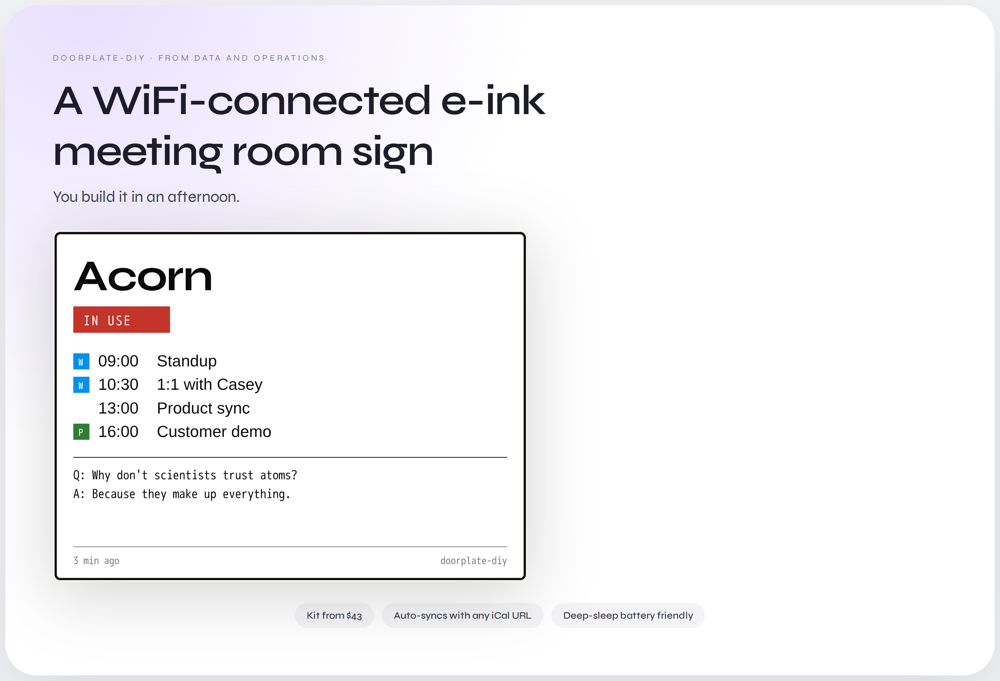

# doorplate-diy

**A WiFi-connected e-ink meeting room sign you build in an afternoon.**

From [Data and Operations LLC](https://dataandoperations.com).


<!-- TODO: replace docs/hero.png with a real photo once the first physical sign is built. -->

---

## How it works

```
  ┌─────────────────┐        ┌──────────┐        ┌──────────────┐
  │  Mac (Flask)    │        │   WiFi   │        │  ESP32 + e-  │
  │  control panel  │──/ /──▶│  router  │──/ /──▶│  ink display │
  │  /status /update│        │          │        │              │
  └─────────────────┘        └──────────┘        └──────────────┘
        ▲                                                │
        │             every 15 min: GET /status          │
        └────────────────────────────────────────────────┘
```

The Mac runs a tiny Flask server with a control-panel UI. The ESP32 wakes
from deep sleep every 15 minutes, pulls the current room state over HTTP,
redraws the e-ink panel, and sleeps again.

## Kits

Pre-assembled kits will be available from Data and Operations LLC soon. In
the meantime, the BOMs below tell you how to self-source.

| Kit          | Price   | Panel                                 | Best for                 |
| ------------ | ------- | ------------------------------------- | ------------------------ |
| **Standard** | ~$43    | Waveshare 4.2" B&W                    | Most meeting rooms       |
| **Premium**  | ~$60    | Waveshare 3.6" Spectra 6 color        | Style-forward workspaces |

> **Coming soon** — pre-assembled kits from Data and Operations LLC. For now,
> build your own with the BOMs below.

## Quick start

**1. Clone the repo on the Mac that will control the sign.**

```bash
git clone https://github.com/dataandoperations/doorplate-diy.git
cd doorplate-diy
```

**2. Run the server — pick whichever install path you prefer.**

Both paths expose the same control panel at `http://<your-mac>.local:5000`.

<details open>
<summary><strong>Option A — Python + pip</strong></summary>

```bash
make install-dev
make dev
```
</details>

<details>
<summary><strong>Option B — Docker</strong></summary>

Requires Docker Desktop (or any Docker runtime). The `unless-stopped`
restart policy keeps the sign alive across Mac restarts once Docker is
running at login.

```bash
make docker-up     # or: docker compose up -d
make docker-logs   # tail logs
make docker-down   # stop
```

Pass an auth token via env var: `DOORPLATE_TOKEN=your-secret make docker-up`.
Persistent state (`sign_data.json`) lands in `./data/`, which is gitignored.
</details>

**3. Open the control panel** at `http://<your-mac>.local:5000`, edit the
   room name + schedule, and hit **Push to Sign**.

**4. Flash the ESP32** with ESPHome:

```bash
cd esphome
# edit secrets.yaml with your WiFi creds
# drop Roboto TTFs into esphome/fonts/ (see "Fonts" below)
esphome run meeting-sign.yaml
```

**5. Slot the panel into a picture frame** (see **Case** below).

## Test without hardware

You don't need an ESP32 or e-ink panel to try this end-to-end:

1. **Browser preview** — `make dev`, open the control panel, and the
   right-side placard preview mirrors what the e-ink will render as you
   type.
2. **Pixel-accurate PNG** — `make preview` (or
   `python server/render_preview.py`) produces `preview.png` at 400×300,
   using the same fonts and layout as the ESPHome lambda.
3. **Firmware validation** — `make esphome-validate` checks the YAML and
   `esphome compile esphome/meeting-sign.yaml` builds the firmware binary.
   No hardware required.

## Fonts

ESPHome and `render_preview.py` both expect Roboto TTFs in
`esphome/fonts/` (gitignored). Fetch them once:

```bash
mkdir -p esphome/fonts && cd esphome/fonts
roboto="https://github.com/googlefonts/roboto/raw/main/src/hinted"
mono="https://github.com/googlefonts/robotomono/raw/main/fonts/ttf"
curl -fLO "$roboto/RobotoCondensed-Bold.ttf"
curl -fLO "$roboto/RobotoCondensed-Regular.ttf"
curl -fLO "$mono/RobotoMono-Regular.ttf"
```

Roboto is Apache-2.0 licensed, so it's safe to redistribute — we just don't
commit the binaries to keep the repo lean.

## Finding your Mac from the sign

The ESPHome config points at `your-mac.local`. macOS advertises that
hostname automatically via Bonjour. To find yours:

```bash
scutil --get LocalHostName
```

Set that value in `esphome/meeting-sign.yaml` under `substitutions.server_host`.
If DHCP is flaky on your network, reserve a static lease on your router and
put the IP address there instead.

## Keeping the server running

Closing the terminal kills the Flask server. Two ways to keep it alive:

- **Docker** — `docker compose up -d` already uses `restart: unless-stopped`.
  Enable "Start Docker Desktop when you log in" in Docker Desktop settings
  and you're done.
- **pip + launchd** — install the launchd agent:
  ```bash
  # Edit the absolute paths inside the plist first, then:
  cp ops/com.dataandoperations.doorplate.plist ~/Library/LaunchAgents/
  launchctl load ~/Library/LaunchAgents/com.dataandoperations.doorplate.plist
  tail -f ~/Library/Logs/doorplate.log
  ```

For casual use, `tmux new -s doorplate 'make dev'` or `caffeinate -i make dev`
works fine too.

## Auth

By default, `POST /update` accepts anything on the LAN — fine for a trusted
home or office network.

To require a shared secret:

```bash
export DOORPLATE_TOKEN="pick-something-random"
make dev
```

Then match it on the sign side (`esphome/meeting-sign.yaml`, substitution
`doorplate_token`) and in the control panel
(`localStorage.setItem('doorplateToken', '...')` from the browser console).

## Case — picture-frame hack

No custom enclosure required. Both panels drop cleanly into a 5×7"
shadow-box picture frame.

- **Recommended**: [IKEA RIBBA 5×7" (13×18 cm)](https://www.ikea.com/) — deep
  enough (~4.5 cm) that the driver board and USB-C cable sit comfortably
  behind the mat.
- Replace the paper insert with the e-ink panel, facing outward.
- The driver board + USB-C cable live in the shadow-box cavity behind.
- Trim the mat to expose the active display area (~91×77 mm for 4.2",
  ~75×55 mm for 3.6").
- Mount with 3M Command strips or the frame's built-in hanger.
- Notch the frame back (file, utility knife, or Dremel) to route the USB-C
  cable out, or run it through the existing hanger slot.

**Alternates**: IKEA FISKBO (~$3, thinner depth — cable routing is tighter),
or any 5×7" shadow-box frame with ≥25 mm rebate depth.

## Bill of materials

### Standard Kit — Waveshare 4.2" B&W (~$43)

| Part                              | Est. cost | Link                                                                                      |
| --------------------------------- | --------: | ----------------------------------------------------------------------------------------- |
| Waveshare 4.2" e-Paper Module     |    $25    | https://www.waveshare.com/4.2inch-e-paper-module.htm                                      |
| Waveshare ESP32 Driver Board      |    $10    | https://www.waveshare.com/product/e-paper-esp32-driver-board.htm                          |
| USB-C cable                       |     $3    | Any 6' USB-C charging cable                                                               |
| IKEA RIBBA 5×7" picture frame     |     $5    | Any 5×7" shadow-box frame with ≥25 mm rebate                                              |

### Premium Kit — Waveshare 3.6" Spectra 6 color (~$60)

| Part                                   | Est. cost | Link                                                                                      |
| -------------------------------------- | --------: | ----------------------------------------------------------------------------------------- |
| Waveshare 3.6" e-Paper (Spectra 6)     |    $42    | https://www.waveshare.com/3.6inch-e-paper-module-g.htm                                    |
| Waveshare ESP32 Driver Board           |    $10    | https://www.waveshare.com/product/e-paper-esp32-driver-board.htm                          |
| USB-C cable                            |     $3    | Any 6' USB-C charging cable                                                               |
| IKEA RIBBA 5×7" picture frame          |     $5    | Any 5×7" shadow-box frame with ≥25 mm rebate                                              |

## Wiring

Both kits use Waveshare's ESP32 Driver Board, which is a drop-in HAT for
their e-paper panels. The driver board has a 24-pin FPC connector that
accepts Waveshare e-paper panels directly — no loose wires required. The
GPIO → panel mapping is fixed:

| Panel signal | ESP32 GPIO |
| ------------ | ---------: |
| BUSY         | GPIO25     |
| RESET        | GPIO26     |
| DC           | GPIO27     |
| CS           | GPIO15     |
| CLK (SCLK)   | GPIO13     |
| MOSI         | GPIO14     |

If you're using a bare ESP32 + loose panel instead of the driver board,
wire per the table above and verify `esphome/meeting-sign.yaml` matches.

## File structure

```
doorplate-diy/
├── .github/workflows/ci.yml       # status checks (ruff, pytest, html, esphome)
├── Makefile                       # make install-dev / dev / test / ci / preview
├── LICENSE                        # MIT
├── README.md
├── pyproject.toml                 # ruff + black config
├── .pre-commit-config.yaml
├── Dockerfile                     # optional container path
├── docker-compose.yml             # optional container path
├── .dockerignore
├── docs/
│   └── roadmap-current.md         # living Now/Next/Later
├── ops/
│   └── com.dataandoperations.doorplate.plist
├── server/
│   ├── server.py                  # Flask app: /, /status, /update, /themes
│   ├── render_preview.py          # PIL-based hardware-free simulator
│   ├── requirements.txt
│   ├── requirements-dev.txt
│   ├── tests/
│   │   ├── test_server.py
│   │   └── test_render_preview.py
│   └── static/
│       ├── index.html             # control panel (vanilla JS)
│       └── themes/                # ink.css / terminal.css / newsprint.css
└── esphome/
    ├── meeting-sign.yaml
    ├── secrets.yaml               # gitignored template
    └── fonts/                     # gitignored — drop Roboto TTFs here
```

## Roadmap

See [`docs/roadmap-current.md`](docs/roadmap-current.md) for the full
Now / Next / Later view. Highlights:

- **Next**: Google Calendar integration, multi-room support, Home Assistant.
- **Later**: 3D-printable case, Spectra 6 color rendering path, presence
  sensor auto-flip.

## Contributing

Found a bug or want a feature? Open an issue at
[github.com/dataandoperations/doorplate-diy/issues](https://github.com/dataandoperations/doorplate-diy/issues).

## License

MIT. See [LICENSE](LICENSE).
